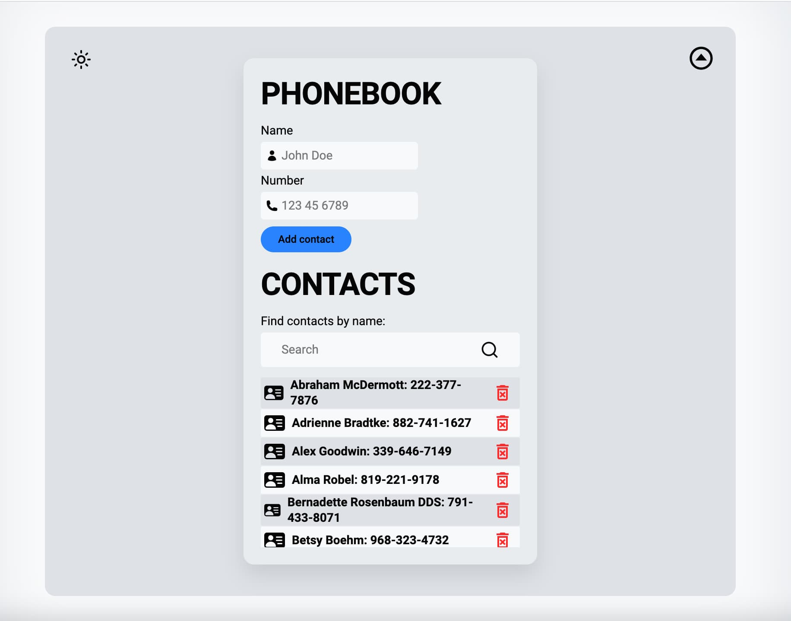
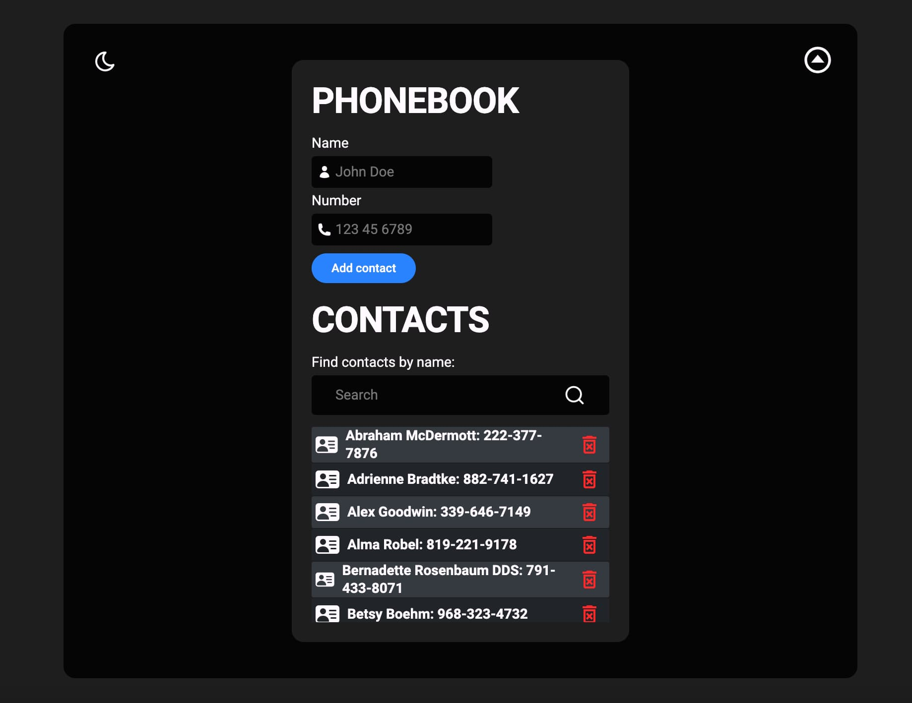

# **Async Redux CRUD Phonebook App**

## Description

The Async Redux CRUD App is a React application that showcases asynchronous data management using Redux Toolkit's `createAsyncThunk`, Axios for API calls, and CRUD operations (Create, Read, Update, Delete) with mockapi.io as the backend service. This project is designed to help you understand how to integrate Redux Toolkit with asynchronous actions and a remote API.

## Key Features and Technologies Used:

- Front-End Framework: React
- Styling: Styled Components
- Axios for making API requests
- Data provided by mockapi.io
- API Integration:
  - View a list of contacts from the API
  - Add new contacts
  - Delete contacts
  - Filter existing contacts
  - Asynchronous data fetching and updating
- Data persistence with Redux Toolkit
- State management with Redux Toolkit

## Project Preview

### Screenshots

_Caption for Screenshot 1_

_Caption for Screenshot 2_

## Issues

If you encounter any issues or have suggestions, please [open an issue](https://github.com/Alexandrbig1/goit-react-hw-07-phonebook/issues).

## License

This project is licensed under the [MIT License](LICENSE).

## Acknowledgments

A special thanks to the following for their contributions to this project:

- [mockapi.io](https://www.mockapi.io/): A versatile and convenient backend service for providing mock data. This project wouldn't be possible without the support and features offered by mockapi.io.

## Languages and Tools:

  
 

## Connect with me:

  

  

